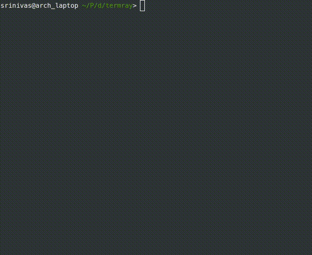

## termray

> termray is a small (< 250 SLOC) ray-tracing demo that can run in most terminal emulators

### Demo
 

### Usage

```sh
termray [aspect ratio] [width] [height]
```

### Setup
```sh
make
./termray
```

### Options
```c
aspect ratio -- the ratio between the font character height and width
width -- the number of columns in your terminal
height -- the number of rows in your terminal
```
